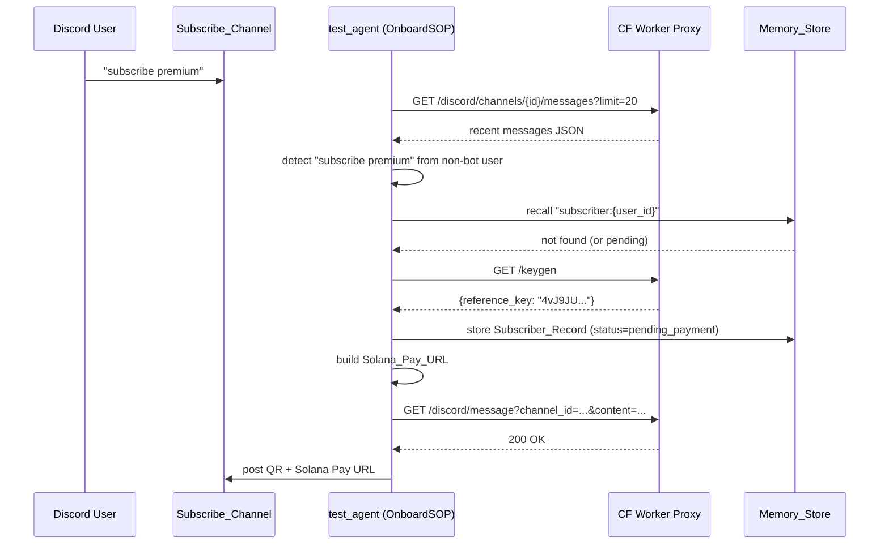
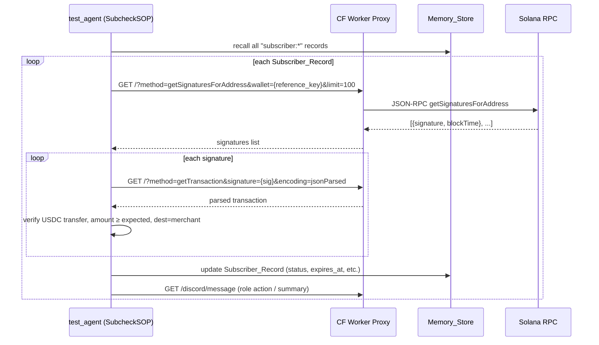
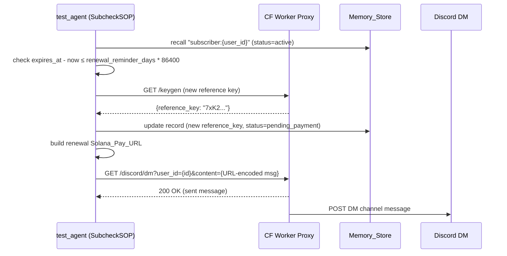

# Design Document: Solana Pay Onboarding

## Overview

This design replaces the static `wallet_mapping.json`-based subscription system with a fully self-service, Solana Pay-driven flow for the ZeroClaw `test_agent`. Subscribers type a `subscribe` command in Discord, receive a Solana Pay URL and QR code, pay in USDC, and the system automatically verifies the on-chain payment and manages their Discord role.

The architecture is constrained by the ZeroClaw runtime: the agent's `locked_down` risk profile allows only `http_request` and `read_file` tools, and the `http_request` tool has a POST body bug that routes all writes through the existing Cloudflare Worker proxy via GET requests with URL-encoded parameters. No private keys are held anywhere and the system never signs transactions (T1 custody tier).

**Key design decisions:**

1. **Reference key generation via Proxy `/keygen` endpoint** — The agent cannot call crypto libraries. The Proxy adds a `/keygen` endpoint that generates 32 cryptographically random bytes using the Web Crypto API and returns them base58-encoded. The agent calls this via `http_request` GET and stores the result. This is the only viable option given the `locked_down` tool constraint; UUID-based derivation would not produce 32-byte base58 strings conforming to the Solana Pay spec.

2. **Discord polling for subscribe commands** — The agent runs on an hourly cron. Real-time event streaming is incompatible with the agent's execution model. On each cron cycle the agent polls the Subscribe_Channel for recent messages via the Proxy. To handle subscribe commands quickly a second, higher-frequency cron trigger (every 5 minutes) is added for the new `onboarding_check` SOP. This satisfies the ≤5-second response requirement within a bounded polling model.

3. **Memory_Store as sole subscriber state** — All Subscriber_Records are stored in ZeroClaw Memory_Store (`brain.db`) keyed `"subscriber:<discord_user_id>"`. The wallet_mapping.json is fully deprecated. Migration seeds existing wallet entries as Subscriber_Records on first cron run.

4. **Configuration in SOP.md context** — Tier definitions (`standard`, `premium`), `grace_period_days`, and `renewal_reminder_days` are embedded in the SOP.md context block so they are readable by the agent without requiring redeployment or shell access.

5. **Amount comparisons in integer arithmetic** — All USDC amount checks use raw token units (1 USDC = 1,000,000 units) to avoid floating-point rounding errors.


---

## Architecture

### System Component Diagram

```mermaid
graph TD
    subgraph Discord
        User([Discord User])
        Channel[Subscribe_Channel]
        DM[Direct Message]
        Role[Subscriber_Role]
    end

    subgraph ZeroClaw Agent ["ZeroClaw test_agent (locked_down)"]
        OnboardSOP[onboarding_check SOP\nevery 5 min cron]
        SubcheckSOP[subscription_check SOP\nhourly cron]
        OnboardSkill[onboarding SKILL]
        CheckPaySkill[check-payment SKILL]
        MemStore[(Memory_Store\nbrain.db)]
    end

    subgraph Proxy ["Cloudflare Worker Proxy\nsolana-rpc-proxy.dharadarsh0.workers.dev"]
        ProxyRPC[/Solana RPC relay/]
        ProxyMsg[/discord/message\]
        ProxyDM[/discord/dm\]
        ProxyKeygen[/keygen\]
    end

    subgraph Solana
        RPC[Solana RPC\ndevnet]
        Chain[On-chain USDC transfer\nwith reference key]
    end

    User -->|"subscribe [tier]"| Channel
    OnboardSOP -->|poll messages GET /discord/messages| Proxy
    Proxy -->|Discord API GET channels/messages| Channel
    OnboardSkill -->|GET /keygen| ProxyKeygen
    OnboardSkill -->|write Subscriber_Record| MemStore
    OnboardSkill -->|GET /discord/message| ProxyMsg
    ProxyMsg -->|POST channels/messages| Channel
    User -->|USDC payment with reference key| Chain
    SubcheckSOP -->|read Subscriber_Records| MemStore
    CheckPaySkill -->|GET getSignaturesForAddress| ProxyRPC
    ProxyRPC -->|JSON-RPC POST| RPC
    CheckPaySkill -->|update Subscriber_Record| MemStore
    CheckPaySkill -->|GET /discord/message role actions| ProxyMsg
    SubcheckSOP -->|GET /discord/dm renewal links| ProxyDM
    ProxyDM -->|POST DM channel| DM
```



### Data Flow: Onboarding



### Data Flow: Payment Verification



### Data Flow: Renewal DM




---

## Components and Interfaces

### 1. Cloudflare Worker Proxy (`solana-rpc-proxy/worker.js`) — Extensions

The existing proxy handles `/?method=getSignaturesForAddress`, `/?method=getTransaction`, and `/discord/message`. Three additions are required:

#### `/keygen` endpoint (NEW)

- **Request:** `GET /keygen`
- **Response:** `{"reference_key": "<44-char base58 string>"}` with status 200
- **Implementation:** Uses `crypto.getRandomValues()` (available in Cloudflare Workers via the Web Crypto API) to fill a 32-byte `Uint8Array`, then encodes it with the Bitcoin base58 alphabet (`123456789ABCDEFGHJKLMNPQRSTUVWXYZabcdefghijkmnopqrstuvwxyz`). The encoding uses big-integer division (repeated modulo-58) preserving leading zero bytes as `1` characters. Returns a 32-byte base58 string (typically 43–44 chars).
- **Stateless:** No key is stored. Each call produces an independent random output.

#### `/discord/dm` endpoint (NEW)

- **Request:** `GET /discord/dm?user_id=<discord_user_id>&content=<URL-encoded message>`
- **Flow:**
  1. POST `https://discord.com/api/v10/users/<user_id>/channels` with `{}` body and `Authorization: Bot <DISCORD_BOT_TOKEN>` → receives `{id: <dm_channel_id>}`
  2. POST `https://discord.com/api/v10/channels/<dm_channel_id>/messages` with `{"content": "<message>"}` → returns sent message object
- **Errors:** Missing params → 400 `{"error":"missing required parameter: <name>"}`. First Discord call fails → short-circuit, return error. Content > 2000 chars (after URL-decode) → 400.
- **Security:** `DISCORD_BOT_TOKEN` is a Cloudflare Worker secret; never appears in URLs or responses.

#### `/discord/channels/{id}/messages` passthrough (NEW)

- **Request:** `GET /discord/channels/<channel_id>/messages?limit=<n>`
- **Forward:** `GET https://discord.com/api/v10/channels/<channel_id>/messages?limit=<n>` with `Authorization: Bot <token>`
- **Response:** Raw Discord API JSON forwarded unchanged.
- Used by OnboardSOP to poll Subscribe_Channel for recent messages.

#### Updated error handling for RPC endpoints

The existing primary/fallback retry logic continues unchanged. The proxy returns `{"error":"both primary and fallback RPC endpoints failed"}` with status 502 when both fail. The 5-second timeout and 5xx-triggered fallback also continue as currently implemented.

#### Updated `limit` parameter validation

`getSignaturesForAddress` requests with `limit` absent, non-integer, < 1, or > 1000 return 400 with a descriptive error body (as per Requirement 11.5). This is validated before forwarding.

---

### 2. Onboarding SKILL (`shared/skills/default/onboarding/SKILL.md`) — NEW

A new skill that the OnboardSOP invokes when a subscribe command is detected.

**Inputs (from SOP context):**
- `discord_user_id`, `discord_username`
- `tier` (parsed from message text, defaulting to `standard`)
- Tier config: `{ standard: {amount: 10.0, period_days: 30}, premium: {amount: 25.0, period_days: 30} }`

**Steps:**
1. Recall `"subscriber:{discord_user_id}"` from Memory_Store.
   - If status = `active`: reply to channel with "already active, expires {expires_at}" and stop.
   - If status = `pending_payment`: reply with existing Solana Pay URL and QR (re-read from stored record) and stop.
2. Validate tier. If not in `[standard, premium]`, post error listing valid tiers and stop.
3. Call `GET /keygen` on Proxy. On failure: post error, abort (do not write record).
4. Validate `expected_amount_usdc` > 0 with ≤ 6 decimal places. On failure: post error, abort.
5. Write Subscriber_Record to Memory_Store with status = `pending_payment` (see schema below). On write failure: discard key, post error, abort.
6. Construct `Solana_Pay_URL`:
   ```
   solana:<Merchant_Wallet>?amount=<expected_amount_usdc>&spl-token=<USDC_Mint>&reference=<reference_key>&label=ZeroClaw+Subscription&memo=<discord_user_id>
   ```
7. Call `GET https://chart.googleapis.com/chart?chs=300x300&cht=qr&chl=<URL-encoded Solana_Pay_URL>` (10-second timeout). On failure: post error, abort.
8. Post to Subscribe_Channel via `GET /discord/message?channel_id=...&content=<URL-encoded>`:
   ```
   @{discord_username} — ZeroClaw {tier} subscription ({expected_amount_usdc} USDC / {period_days} days)
   Pay here: {Solana_Pay_URL}
   QR: {QR_URL}
   ```
   On Proxy error: retry once after 2 seconds. If still failing: log error memory entry, do not silently discard.

---

### 3. Onboarding SOP (`agents/test_agent/workspace/sops/onboarding_check/SOP.md`) — NEW

**Trigger:** Cron every 5 minutes (`*/5 * * * *`).

**Steps:**
1. Poll Subscribe_Channel for last 20 messages via `GET /discord/channels/1531347878906302487/messages?limit=20` through Proxy.
2. For each message (newest-first):
   - Skip if `author.bot = true`.
   - Skip if message does not contain standalone `subscribe` (case-insensitive regex: `\bsubscribe\b`).
   - Extract tier from message text (second word after "subscribe"; default `standard` if absent or unrecognized).
   - Invoke Onboarding SKILL with `discord_user_id`, `discord_username`, `tier`.
3. Memory_Store unavailability: post "service temporarily unavailable" reply, abort cycle without partial record creation.

**SOP.toml trigger addition:**
```toml
[[triggers]]
type = "cron"
schedule = "*/5 * * * *"
```

---

### 4. Updated check-payment SKILL (`shared/skills/default/check-payment/SKILL.md`) — REWRITE

**Key changes from current version:**
- Receives a `Subscriber_Record` object from the SOP context (not a wallet address from `wallet_mapping.json`).
- Calls `getSignaturesForAddress` on `reference_key` (not on Merchant_Wallet).
- Enforces amount verification using integer raw token units.
- Respects `period_days` subscription window for transaction filtering.
- Returns a structured result including `status`, `role_action`, `expires_at`, and `highest_amount_usdc_seen`.

**Steps:**
1. Call `GET /?method=getSignaturesForAddress&wallet={reference_key}&limit=100`. On proxy error → status = `check_failed`.
2. For each signature, call `GET /?method=getTransaction&signature={sig}&encoding=jsonParsed`. On error → mark that signature as `check_failed` and continue.
3. Filter transactions:
   - `blockTime` must be within `[subscribed_at_unix, subscribed_at_unix + period_days * 86400]`. Transactions outside window are discarded.
   - Must contain a USDC SPL token transfer instruction.
   - Transfer destination must be Merchant_Wallet or its associated token account.
   - USDC mint must match `4zMMC9srt5Ri5X14GAgXhaHii3GnPAEERYPJgZJDncDU`.
   - Transfer amount in raw units ≥ `expected_amount_usdc × 1,000,000` (integer comparison).
4. If qualifying transactions found: select highest `blockTime`. Set status = `active`, `subscribed_at` = blockTime, `expires_at` = blockTime + `period_days * 86400`.
5. If no qualifying transactions and at least one USDC transfer of insufficient amount was found: status = `lapsed`, post insufficient-amount notice.
6. If no USDC transactions at all: status = `lapsed`.
7. Check Discord role via `GET /guilds/1531347878906302484/members/{discord_user_id}`.
8. Apply role logic (grant/propose-removal/no-change) using grace and effective-status rules.

---

### 5. Updated subscription_check SOP (`agents/test_agent/workspace/sops/subscription_check/SOP.md`) — REWRITE

**Key changes from current version:**
- Replaces hardcoded wallet list with dynamic Memory_Store recall.
- Adds renewal reminder step.
- Adds grace period enforcement.
- Adds consolidated summary message.

**Steps:**
1. Recall all memory entries matching key prefix `"subscriber:"` from Memory_Store. On failure: post operator alert, terminate cycle.
2. If list is empty: post "no subscribers registered" notice, terminate.
3. **Migration check (one-time):** If Memory_Store has no subscriber records but `wallet_mapping.json` is readable, seed records from the legacy file (see Migration section).
4. For each Subscriber_Record (independent, no stop-on-failure):
   a. Check renewal window: if `status = active` and `expires_at - now ≤ renewal_reminder_days * 86400`:
      - If `reference_key` was not already rotated for this expiry cycle (dedup check): call `/keygen`, update record with new `reference_key`, set status = `pending_payment`, send renewal DM via `/discord/dm`. Retry DM up to 3 cycles on proxy failure.
   b. Invoke check-payment SKILL with the Subscriber_Record.
   c. Apply grace period logic:
      - If status = `lapsed` and `grace_started_at` is null: set `grace_started_at = now`, persist, treat as `grace` this cycle, post grace reminder with renewal URL to channel.
      - If status = `lapsed` and `now - grace_started_at < grace_period_days * 86400`: treat as `grace`, retain role, no removal.
      - If status = `lapsed` and `now - grace_started_at ≥ grace_period_days * 86400`: effective status = `expired`, post role removal proposal.
   d. Execute Discord role action:
      - `active` + no role → grant role (no approval needed).
      - `expired` + has role → post removal proposal, await admin approval.
      - `check_failed` → no role change, post error notice.
      - `grace` → retain role.
   e. Update Subscriber_Record in Memory_Store.
5. Post consolidated summary to Subscribe_Channel (split at 2000 chars if needed).


---

## Data Models

### Subscriber_Record Schema

Memory_Store key: `"subscriber:<discord_user_id>"`
Memory_Store value: JSON-serialized object with the following fields.

| Field | Type | Required | Description |
|---|---|---|---|
| `discord_user_id` | string | yes | Discord snowflake ID of the subscriber |
| `discord_username` | string | yes | Discord username at time of onboarding |
| `wallet_address` | string \| null | yes | Subscriber's Solana wallet (null until confirmed on-chain) |
| `tier` | string | yes | `"standard"` or `"premium"` |
| `expected_amount_usdc` | number | yes | Required USDC amount (float, e.g. `10.0`) |
| `period_days` | integer | yes | Subscription duration in days (e.g. `30`) |
| `subscribed_at` | string \| null | yes | ISO 8601 UTC timestamp of confirmed payment block time, or null if pending |
| `expires_at` | string \| null | yes | ISO 8601 UTC timestamp of expiry (`subscribed_at + period_days * 86400s`), or null if pending |
| `grace_started_at` | string \| null | yes | ISO 8601 UTC timestamp when grace period began, or null |
| `reference_key` | string | yes | Base58-encoded 32-byte reference key for current invoice |
| `status` | string | yes | One of: `pending_payment`, `active`, `lapsed`, `grace`, `expired`, `check_failed` |
| `last_known_status` | string \| null | no | Previous status, saved when transitioning to `check_failed` |
| `renewal_dm_sent_for_expiry` | string \| null | no | ISO 8601 UTC value of `expires_at` at the time the last renewal DM was sent; used for dedup |

**Example:**
```json
{
  "discord_user_id": "1531681016249319576",
  "discord_username": "adrs0890",
  "wallet_address": null,
  "tier": "premium",
  "expected_amount_usdc": 25.0,
  "period_days": 30,
  "subscribed_at": null,
  "expires_at": null,
  "grace_started_at": null,
  "reference_key": "4vJ9JU1bfGg1xPcDxY2xFRG7JbN3TxWqZvKmPsHcL8E",
  "status": "pending_payment",
  "last_known_status": null,
  "renewal_dm_sent_for_expiry": null
}
```

### Tier Configuration (embedded in SOP.md context)

```toml
[tiers.standard]
amount_usdc = 10.0
period_days = 30

[tiers.premium]
amount_usdc = 25.0
period_days = 30

[subscription]
grace_period_days = 3
renewal_reminder_days = 5
```

### Solana_Pay_URL Structure

```
solana:<Merchant_Wallet>?amount=<expected_amount_usdc>&spl-token=<USDC_Mint>&reference=<reference_key>&label=ZeroClaw+Subscription&memo=<discord_user_id>
```

Where:
- `Merchant_Wallet` = `pt6Ws1FMbdrLbUZqKooediS8mu6SNvDJodzXUx6ypak`
- `USDC_Mint` = `4zMMC9srt5Ri5X14GAgXhaHii3GnPAEERYPJgZJDncDU`
- `expected_amount_usdc` is expressed as a decimal string (e.g. `10.0` or `25.0`)
- `reference_key` is the base58-encoded 32-byte array (44 chars)
- `memo` = subscriber's Discord user ID (URL-encoded if needed)

Per the [Solana Pay Specification v1](https://solana.com/docs/tools/solana-pay/specification/version1), `reference` values must be base58-encoded 32-byte arrays. They need not be valid Ed25519 public keys; wallets include them as read-only non-signer keys in the transaction, enabling `getSignaturesForAddress` lookup.

### Memory_Store Key Conventions

| Key Pattern | Contents |
|---|---|
| `subscriber:<discord_user_id>` | Subscriber_Record JSON |
| `error:<timestamp>:<discord_user_id>` | Error log entry (onboarding failures) |
| `operator_alert:<timestamp>` | Operator alert log (cron failures) |

### `/keygen` Response Schema

```json
{"reference_key": "<44-char base58 string>"}
```

### `/discord/dm` Response Schema (success)

```json
{
  "dm_channel_id": "<snowflake>",
  "message_id": "<snowflake>",
  "status": 200
}
```

### Migration from `wallet_mapping.json`

The legacy file has two entries with fields `discord_user_id`, `discord_username`, `status`, `grace_started_at`. The migration procedure (executed once at first cron run after deployment):

1. Read `/Users/adarsh/Documents/zeroclaw/wallet_mapping.json` via `read_file` tool.
2. For each entry, construct a minimal Subscriber_Record:
   - `discord_user_id`, `discord_username` from file.
   - `wallet_address` = the JSON key (wallet address from legacy file).
   - `tier` = `"standard"` (default; no tier info in legacy file).
   - `expected_amount_usdc` = 10.0, `period_days` = 30.
   - `subscribed_at` = null, `expires_at` = null.
   - `grace_started_at` = value from file (null in both existing entries).
   - `reference_key` = new key generated via `/keygen` (each migrated subscriber gets a fresh pending invoice).
   - `status` = `"pending_payment"` (requires re-verification; legacy records had `lapsed` status, so no active role is at risk; they get a fresh payment request).
3. Store each record in Memory_Store.
4. The SOP proceeds normally with the newly seeded records.

After migration, `wallet_mapping.json` is no longer read by any component.


---

## Correctness Properties

*A property is a characteristic or behavior that should hold true across all valid executions of a system — essentially, a formal statement about what the system should do. Properties serve as the bridge between human-readable specifications and machine-verifiable correctness guarantees.*

### Property 1: Subscribe command detector correctly classifies messages

*For any* string input, the standalone-subscribe detector SHALL return `true` if and only if the string contains the word `subscribe` as a whole word (matching the regex `\bsubscribe\b`, case-insensitive), and SHALL return `false` for strings that contain "unsubscribe", "subscribed", or no form of "subscribe", and SHALL always return `false` if the message author has `bot = true` regardless of message content.

**Validates: Requirements 1.1, 1.5**

---

### Property 2: Reference key uniqueness and base58 validity

*For any* set of N calls to the `/keygen` endpoint, every returned `reference_key` SHALL consist only of characters from the base58 alphabet (`123456789ABCDEFGHJKLMNPQRSTUVWXYZabcdefghijkmnopqrstuvwxyz`), SHALL have a byte length of exactly 32 when decoded, and all N values SHALL be pairwise distinct.

**Validates: Requirements 2.1**

---

### Property 3: Solana Pay URL structural completeness

*For any* valid combination of (`merchant_wallet`, `expected_amount_usdc`, `usdc_mint`, `reference_key`, `discord_user_id`), the constructed Solana_Pay_URL SHALL start with `"solana:"`, contain `merchant_wallet` as the pathname, and contain query parameters `amount`, `spl-token`, `reference`, `label`, and `memo` with values equal to the respective inputs (with `label=ZeroClaw+Subscription` and `memo=discord_user_id`).

**Validates: Requirements 3.1**

---

### Property 4: Amount field validation

*For any* numeric value `v`, the amount validator SHALL accept `v` if and only if `v > 0` and the number of decimal digits in `v` is ≤ 6; it SHALL reject `v ≤ 0` and any value with more than 6 decimal places.

**Validates: Requirements 3.4**

---

### Property 5: Discord onboarding message contains all required fields

*For any* valid Subscriber_Record, the Discord message string constructed by the Onboarding SKILL SHALL contain: the Discord mention of the subscriber, the full Solana_Pay_URL, the QR code URL, the tier name, the USDC amount as a decimal string, and the subscription period in days.

**Validates: Requirements 3.3**

---

### Property 6: Subscriber_Record serialization round-trip

*For any* valid Subscriber_Record object, serializing to JSON and then deserializing SHALL produce a record with field-by-field equal values for all 11 required fields (`discord_user_id`, `discord_username`, `wallet_address`, `tier`, `expected_amount_usdc`, `period_days`, `subscribed_at`, `expires_at`, `grace_started_at`, `reference_key`, `status`); datetime fields (`subscribed_at`, `expires_at`, `grace_started_at`) SHALL be preserved as ISO 8601 UTC strings with millisecond precision (pattern `\d{4}-\d{2}-\d{2}T\d{2}:\d{2}:\d{2}\.\d{3}Z`) or as `null`.

**Validates: Requirements 4.2, 13.2, 13.3**

---

### Property 7: Subscription expiry calculation

*For any* `subscribed_at` Unix timestamp (integer, valid UTC epoch) and `period_days` integer in [1, 3650], the computed `expires_at` Unix timestamp SHALL equal `subscribed_at + period_days * 86400`, with no floating-point arithmetic involved.

**Validates: Requirements 4.3**

---

### Property 8: Transaction payment validation correctness

*For any* parsed transaction object and Subscriber_Record, the payment validator SHALL return `qualifying = true` if and only if ALL of the following hold simultaneously: (a) the transaction contains a USDC SPL token transfer instruction, (b) the transfer destination is the Merchant_Wallet (`pt6Ws1FMbdrLbUZqKooediS8mu6SNvDJodzXUx6ypak`) or its associated token account, (c) the USDC mint is `4zMMC9srt5Ri5X14GAgXhaHii3GnPAEERYPJgZJDncDU`, and (d) the transfer amount in raw token units (integer) is ≥ `expected_amount_usdc × 1,000,000`. If any condition fails, the validator SHALL return `qualifying = false`.

**Validates: Requirements 5.3, 6.1, 6.2, 6.3, 6.6**

---

### Property 9: Subscription window filter

*For any* `blockTime` (Unix timestamp), `subscribed_at` (Unix timestamp), and `period_days` integer, the window filter SHALL return `inside = true` if and only if `subscribed_at ≤ blockTime ≤ subscribed_at + period_days * 86400`, and `inside = false` otherwise.

**Validates: Requirements 5.7**

---

### Property 10: Bounded configuration value clamping

*For any* integer or null input value `v` for a bounded configuration field with range [1, 30] and default `d`, the resolved effective value SHALL be: `d` if `v` is null, absent, or not a valid integer; `1` if `v < 1`; `30` if `v > 30`; or `v` otherwise.

**Validates: Requirements 8.1, 9.1**

---

### Property 11: Grace period window enforcement

*For any* `current_time` (Unix timestamp), `grace_started_at` (Unix timestamp), and effective `grace_period_days` in [1, 30], the grace window check SHALL return `in_grace = true` if `current_time - grace_started_at < grace_period_days * 86400`, and `in_grace = false` if `current_time - grace_started_at ≥ grace_period_days * 86400`.

**Validates: Requirements 8.2**

---

### Property 12: Renewal DM deduplication

*For any* Subscriber_Record where `renewal_dm_sent_for_expiry` is not null and equals `expires_at`, the renewal-check logic SHALL NOT generate a new reference key, SHALL NOT update `status` to `pending_payment`, and SHALL NOT send a DM.

**Validates: Requirements 9.4**

---

### Property 13: Proxy limit parameter validation

*For any* value of the `limit` query parameter in a `getSignaturesForAddress` request, the Proxy SHALL accept the request (return 2xx) if and only if `limit` is an integer satisfying `1 ≤ limit ≤ 1000`; for any other value (non-integer, absent, < 1, > 1000), the Proxy SHALL return status 400.

**Validates: Requirements 11.1, 11.5**

---

### Property 14: Proxy DM content length validation

*For any* URL-encoded `content` query parameter value in a `/discord/dm` request, the Proxy SHALL accept the request if and only if the URL-decoded content has length in [1, 2000] characters; content with length 0 or > 2000 after decoding SHALL result in status 400.

**Validates: Requirements 11.2, 11.4**


---

## Error Handling

### Agent Error Handling Philosophy

Given the `locked_down` risk profile, all error handling occurs through the agent's available tools (`http_request`, `read_file`) and Memory_Store. The agent cannot catch exceptions programmatically — it must reason about failure states from tool output.

| Failure Point | Detection | Response |
|---|---|---|
| `/keygen` proxy error | Non-2xx or no JSON with `reference_key` field | Abort onboarding, post error to channel, do NOT write record |
| Memory_Store write failure | Tool returns error or confirmation absent | Discard key, abort onboarding, post error to channel |
| Discord message post failure | Non-2xx from `/discord/message` | Retry once after 2s; on second failure, log error memory entry |
| QR API timeout / non-2xx | HTTP error or timeout > 10s | Abort onboarding, post error to channel |
| `getSignaturesForAddress` RPC error | Non-2xx or error in JSON-RPC response | Set `status = "check_failed"`, save `last_known_status`, do not change role |
| `getTransaction` failure per signature | Non-2xx or unparseable response | Skip that signature, continue with remaining |
| Memory_Store unavailable at cron start | Tool returns error | Post operator alert to channel, terminate cycle |
| Renewal DM delivery failure | Non-2xx from `/discord/dm` | Retain `status = "pending_payment"`, retry in up to 3 subsequent cycles |
| Discord role grant failure (non-2xx) | HTTP error | Set `status = "check_failed"` for cycle, retain role, post error notice |
| Discord role removal failure after approval | HTTP error | Log failure, post error notice, do NOT retry without new approval |
| Grace reminder post failure | Non-2xx from proxy | Retry once after 2s; if failing, log and continue role evaluation |
| Both RPC endpoints fail | Proxy returns 502 | Agent treats as `check_failed` for affected subscriber |

### Atomicity Guarantees

The system provides write-before-post ordering: the Subscriber_Record is always persisted to Memory_Store before any Discord API call. If the Discord post fails, the record remains in `pending_payment` state and the subscriber can recover by re-issuing the subscribe command (which re-uses the existing pending record per Requirement 1.3).

This means the system is **idempotent on onboarding**: multiple subscribe commands from the same user while `status = "pending_payment"` return the same payment link without generating new keys or records.

### Operator Alerts

Critical failures that require operator attention are posted to Subscribe_Channel via the proxy:
- Memory_Store unavailable at cron start (Req 4.6, 12.2)
- Missing Subscriber_Record for a discord_user_id that should exist (Req 4.7)
- Fatal configuration error (missing tier definition) (Req 7.7)
- Serialization failure when reading a record (Req 13.4)

---

## Testing Strategy

### Dual Testing Approach

Unit tests verify specific examples and edge cases. Property tests verify universal invariants across many generated inputs. Both are needed for comprehensive coverage.

### Property-Based Testing Library

**Target:** Cloudflare Worker proxy (JavaScript) and agent logic helpers (pure functions extracted from SKILL.md/SOP.md context).
**Library:** [fast-check](https://github.com/dubzzz/fast-check) — runs in both Node.js and browser environments, integrates with Vitest or Jest, minimum 100 iterations per property.

### Unit Tests (Example-Based)

Focused on concrete scenarios and integration points:

- **Onboarding flow states:** active → already-active reply; pending → re-use existing URL; Memory_Store unavailable → error reply; keygen failure → abort.
- **Proxy passthrough verification:** correct RPC body construction for each method; Discord DM two-step call sequence.
- **SOP cron cycle:** no subscribers → status notice; check_failed for one subscriber does not stop others; consolidated summary split at 2000 chars.
- **Migration:** wallet_mapping.json entries seeded correctly as pending_payment records.
- **State transitions:** lapsed → sets grace_started_at if null; renewal payment → resets grace_started_at to null; expires_at in past → triggers renewal DM.

### Property Tests (PBT)

Each property test should be tagged with the corresponding design property number.

| Test | Property | Library Arbitraries |
|---|---|---|
| Subscribe detector | Property 1 | arbitrary strings, boolean bot flag |
| Reference key uniqueness & validity | Property 2 | repeat N calls; decode and check |
| Solana Pay URL structure | Property 3 | arbitrary wallet addresses, amounts, keys, user IDs |
| Amount field validation | Property 4 | `fc.float()`, `fc.integer()`, edge values |
| Discord message completeness | Property 5 | arbitrary Subscriber_Records |
| Subscriber_Record round-trip | Property 6 | arbitrary valid Subscriber_Records |
| Expiry calculation | Property 7 | arbitrary unix timestamps, period_days in [1,3650] |
| Transaction payment validation | Property 8 | arbitrary transaction objects, arbitrary amounts |
| Subscription window filter | Property 9 | arbitrary timestamps and period_days |
| Config clamping | Property 10 | `fc.integer()`, null, non-integer strings |
| Grace window check | Property 11 | arbitrary timestamps and grace_period_days |
| Renewal dedup | Property 12 | arbitrary Subscriber_Records with/without matching renewal field |
| Proxy limit validation | Property 13 | `fc.integer()`, non-integer strings, boundary values 0, 1, 1000, 1001 |
| Proxy content length | Property 14 | arbitrary strings of varying length, URL-encoded forms |

**Test configuration:**
```js
// fast-check configuration for all property tests
fc.configureGlobal({ numRuns: 100 });
```

**Tag format** for each test (as a comment):
```js
// Feature: solana-pay-onboarding, Property N: <property_text>
```

### Integration Tests

Integration tests use 1–3 representative examples and are NOT run as property-based tests:

- End-to-end onboarding flow with mocked Proxy responses.
- End-to-end subscription_check SOP cycle with mocked RPC and Discord API.
- Proxy deployed on Cloudflare Workers dev (`wrangler dev`): verify `/keygen`, `/discord/dm`, and `getSignaturesForAddress` routes respond correctly.
- Devnet payment: one real USDC transfer on devnet with a known reference key; verify check-payment SKILL detects it.

